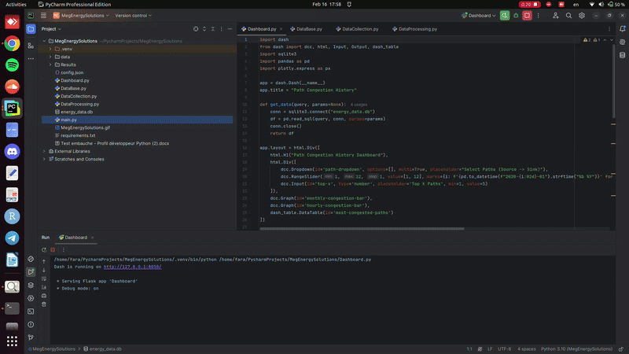

# MagEnergySolution

This project is a Python-based dashboard solution for analyzing and visualizing historical congestion data in the SPP electricity market.




## Definitions
- **Day-Ahead Market (DAM):** A market determining an LMP per node for each hour of the day, one day in advance.
- **Hour Ending:** Identifying the 24 hours of the day by their end, e.g., HE2 from 1:01 to 2:00.
- **Locational Marginal Price (LMP):** Price associated with 1 MW of electricity, composed of energy, congestion, and losses.

## Project Overview
The project involved four key phases:

### **Part 1 – Data Collection**
- Collected historical data from the SPP portal ([Binding Constraints](https://portal.spp.org/pages/da-binding-constraints) and [LMP by Location](https://portal.spp.org/pages/da-lmp-by-location)) using `DataCollection.py`. **Config File:** `config.json` is used for URLs, output directories, and dataset management.

```json
{
  "year": 2020,
  "base_url": "https://portal.spp.org/pages/da-binding-constraints",
  "lmp_url": "https://portal.spp.org/pages/da-lmp-by-location",
  "bc_wait_time": 30,
  "lmp_wait_time": 300
}
```

### **Part 2 – Data Processing**
- Processed collected data to create `DA_BC_HOURLY.CSV` and `DA_LMP_HOURLY.CSV` using `DataProcessing.py`. This script accepts command-line arguments for input directories, output directories, and output filenames.
  - **Arguments:** `--input_dir`, `--output_dir`, `--output_file`
  - **Command Example:** `python DataProcessing.py --input_dir ./data/BC/2020 --output_dir ./Results --output_file DA_BC_HOURLY.CSV`
  - **Command Example:** `python DataProcessing.py --input_dir ./data/lmp/2020 --output_dir ./Results --output_file DA_lmp_HOURLY.CSV`

### **Part 3 – Database Creation**
- Created a local SQLite database with daily and monthly aggregated tables for BC and LMP data using `DatabaseSetup.py`.
  
### **Part 4 – Path Congestion Dashboard**
- Built an interactive Dash dashboard (`Dashboard.py`) to visualize monthly and hourly congestion data.

---

## How to Run the Project

### **Steps to Run**

### Clone the repository
```bash
git clone https://github.com/FFarhangian/MagEnergySolution.git
cd MagEnergySolution
```

### Create and activate the virtual environment

```bash
python -m venv .venv
source .venv/bin/activate  # Linux/Mac
.venv\\Scripts\\activate   # Windows
```

### Install dependencies

```bash
pip install -r requirements.txt
```

### Run the project step by step using main.py

```bash
python main.py
```

